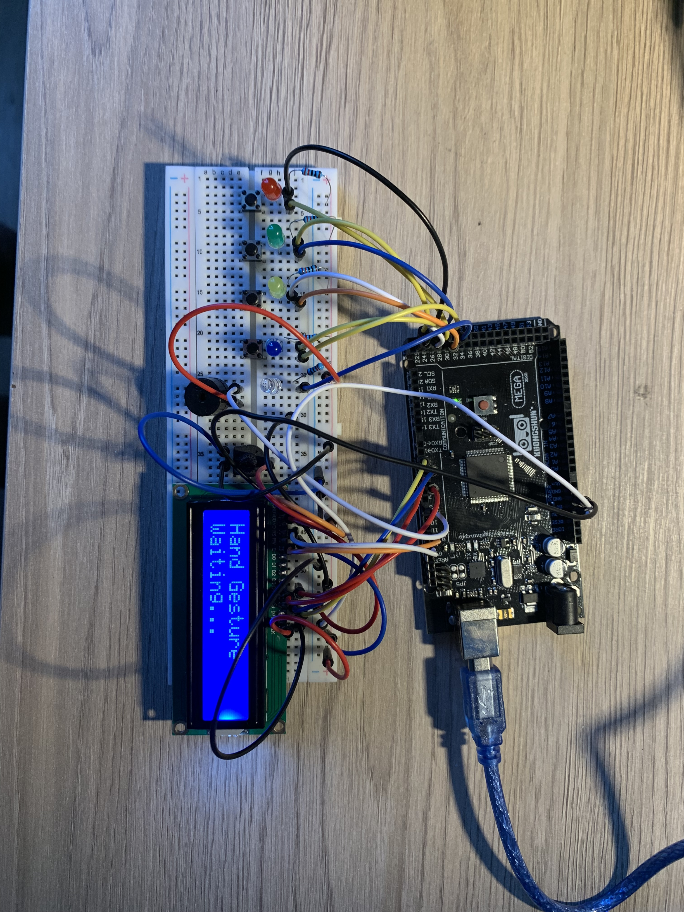

# Color Memory Game — v2 (LCD Upgrade)

Arduino Mega Simon-style color memory game upgraded with a **16x2 LCD** for score, prompts, and cleaner game feedback.

## What’s new in v2
- LCD shows **Round / Score**
- Clear prompts: **“Watch”**, **“Your Turn”**, **“Game Over”**
- Same core gameplay: LEDs play a pattern, buttons repeat it

## Documentation
- [Getting Started (Build + Wiring + Pin Map)](docs/GETTING_STARTED.md)

[Watch the demo on TikTok](https://www.tiktok.com/@l3thabo_o)

## Demo / Photos

ignore the hand gesture on screen, the circuit is the same just had a differnt code running check out the hand gesture project next.

